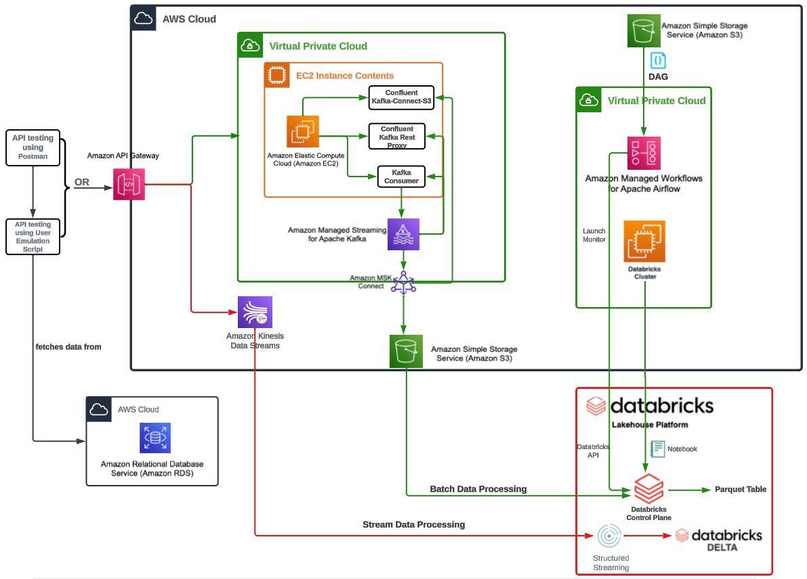

# Pinterest Data Pipeline

## Table of contents

* [Description](#description)
* [Learnings](#learnings)
* [Milestones](#milestones)
* [Installation](#installation)
* [Usage](#usage)
* [File structure of the project](#file-structure-of-the-project)

<small><i><a href='http://ecotrust-canada.github.io/markdown-toc/'>
    Table of contents generated with markdown-toc
</a></i></small>

## Description

This project is based on the Pinterest data pipeline on AWS data engineering services.

The data include:
- Pin (the Pinterest post).
- Geo (the geolocation).
- User (the user details).

AWS data engineering services include:
- Confluent.io Amazon S3 Connector.
- Kafka for batch processing.
- Airflow DAG for scheduling batch processing.
- Kinesis for stream processing.

## Learnings

- `git update-ref -d HEAD` to revert an initial git commit, [stackoverflow](https://stackoverflow.com/questions/6632191/how-to-revert-initial-git-commit)
- `git reset --hard <last_known_good_commit>` to undo pushed commits, [stackoverflow](https://stackoverflow.com/questions/22682870/how-can-i-undo-pushed-commits-using-git)
- `git rm --cached <file>` to unstage.
- TypeError: Object of type datetime is not JSON serializable, [stackoverflow](https://stackoverflow.com/questions/11875770/how-can-i-overcome-datetime-datetime-not-json-serializable)
- For Cron scheduling, [https://crontab.guru/](https://crontab.guru/)
- Python Match Case, [enterprisedna](https://blog.enterprisedna.co/python-match-case/)
- The engine connection object is a facade that uses a DBAPI connection internally in order to  
  communicate with the database.
- PySpark - fillna, [projectpro](https://www.projectpro.io/recipes/explain-fillna-and-fill-functions-pyspark-databricks)
- PySpark - loop through rows, [sparkbyexamples](https://sparkbyexamples.com/pyspark/pyspark-loop-iterate-through-rows-in-dataframe/)
- PySpark - drop columns, [stackoverflow](https://stackoverflow.com/questions/29600673/how-to-delete-columns-in-pyspark-dataframe)
- PySpark - orderBy and sort, [sparkbyexamples](https://sparkbyexamples.com/pyspark/pyspark-orderby-and-sort-explained/)
- PySpark - retrieve top n, [sparkbyexamples](https://sparkbyexamples.com/pyspark/pyspark-retrieve-top-n-from-each-group-of-dataframe/)
- Stream data from Kinesis to Databricks with PySpark, [medium](https://medium.com/road-to-data-engineering/stream-data-from-kinesis-to-databricks-with-pyspark-813c516b4233)
- Learn how to process Steaming Data with DataBricks and Amazon Kinesis [ hands on Demo ], [youtube](https://www.youtube.com/watch?v=2s08mk6vfDk)
- Apache Spark’s Structured Streaming with Amazon Kinesis on Databricks, [databricks](https://www.databricks.com/blog/2017/08/09/apache-sparks-structured-streaming-with-amazon-kinesis-on-databricks.html)
- PySpark partitionBy() – Write to Disk Example, [sparkbyexamples](https://sparkbyexamples.com/pyspark/pyspark-partitionby-example/)
- Advancing Spark - Databricks Delta Streaming, [youtube](https://www.youtube.com/watch?v=-OQGEc09xbY)

## Milestones

- [x] Milestone 1: Set up the environment.
- [x] Milestone 2: Get Started.
- [x] Milestone 3: Batch Processing: Configure the EC2 Kafka client.
- [x] Milestone 4: Batch Processing: Connect an Managed Streaming for Apache Kafka (MSK) cluster to  
                                     an S3 bucket.
- [x] Milestone 5: Batch Processing: Configure an API in API Gateway.
- [x] Milestone 6: Batch Processing: Databricks.
- [x] Milestone 7: Batch Processing: Spark on Databricks.
- [x] Milestone 8: Batch Processing: AWS Managed Workflows for Apache Airflow (MWAA).
- [x] Milestone 9: Stream Processing: AWS Kinesis.

## Installation

- [Python3](https://www.python.org/downloads/)
- [Pandas](https://pandas.pydata.org/docs/getting_started/install.html)
    - Run `pip install pandas`
- [requests](https://pypi.org/project/requests/)
    - Run `pip install requests`
- [sqlalchemy](https://pypi.org/project/SQLAlchemy/)
    - Run `pip install SQLAlchemy`
- [bson](https://pypi.org/project/bson/)
    - Run `pip install bson`
- [yaml](https://pypi.org/project/PyYAML/)
    - Run `pip install PyYAML`
- Create `credentials.yaml` and `config.yaml` in the parent directory to have credentials as per the 
`AWSDBConnector` class and `DAG` file.
- Create `<IAM-user-name>-key-pair.pem` with the RSA private key for EC2 instance connection by SSH.

## Usage
- `cd` to the pinterest-data-pipeline294 directory.
- To emulate sending data to Kafka topics:
    - Connect to the EC2 by SSH client:
        - Log into the [AWS console](https://aws.amazon.com/).
        - Enter the account ID, IAM user name and password.
        - Select the relevant EC2.
        - Click connect and under the SSH Client tab, copy the SSH command to the terminal.
        - Replace `root` with `ec2-user`
        - Example, run `ssh -i "<IAM-user-name>-key-pair.pem" ec2-user@ec2-<IP-address>.compute-1.amazonaws.com`
    - Start the REST proxy:
        - Run `confluent-7.2.0/bin/kafka-rest-start /home/ec2-user/confluent-7.2.0/etc/kafka-rest/kafka-rest.properties`
    - In a new terminal:
        - `cd` to the `pinterest-data-pipeline294` directory.
        - Run `python3 user_posting_emulation.py`
    - To extract and transform data from Kafka:
        - Log into Databricks.
        - Copy the commands from `databricks.ipynb` to Databricks.
- To emulate sending streaming data to Kinesis:
    - In a new terminal:
        - `cd` to the `pinterest-data-pipeline294` directory.
        - Run `python3 user_posting_emulation_streaming.py`
    - To extract and transform data from Kinesis and load to Delta tables:
        - Log into Databricks.
        - Copy the commands from `kinesis_databricks.ipynb` to Databricks.

## File structure of the project

**pinterest-data-pipeline294**  
├── 0a966c04ad33_dag.py  
├── cloud_pinterest_pipeline_architecture.png  
├── config.yaml  
├── credentials.yaml  
├── database_utils.py  
├── databricks.ipynb  
├── kinesis_databricks.ipynb  
├── LICENSE  
├── README.md  
├── user_posting_emulation.py  
└── user_posting_emulation_streaming.py  